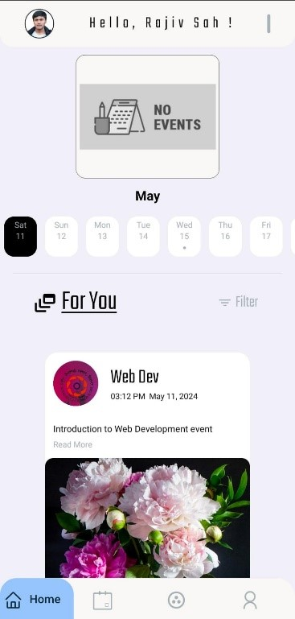

    

        
    

    

        <h2 style="color: #2a3eff; font-size: 1.5em; margin-top: 20px;">Overview</h2>
        
NITS EVENT is a dynamic application tailored exclusively for the vibrant community of NIT Silchar students. It serves as the central hub for all campus events, seamlessly connecting clubs, societies, and students, ensuring nobody misses out on the excitement.

    

    

        <h2 style="color: #2a3eff; font-size: 1.5em; margin-top: 20px;">User Types</h2>
        <ul style="list-style-type: disc; margin-left: 20px; margin-top: 10px;">
            <li><strong>Clubs:</strong> Manage events, registrations, and notifications.</li>
            <li><strong>Students:</strong> Discover events, register, interact with posts, and search for events/clubs.</li>
        </ul>
    

    

        <h2 style="color: #2a3eff; font-size: 1.5em; margin-top: 20px;">Key Features</h2>
        <h3 style="color: #2a3eff; font-size: 1.2em; margin-top: 10px;">For Clubs:</h3>
        <ul style="list-style-type: disc; margin-left: 20px; margin-top: 10px;">
            <li><strong>Event Management:</strong> Clubs can effortlessly create and manage event details, including descriptions, dates, and venues, directly from their home page.</li>
            <li><strong>Student Registration:</strong> Enable students to register for upcoming events with ease, streamlining the organization process.</li>
            <li><strong>Payment Integration:</strong> For paid events, facilitate secure online payments, making transactions hassle-free.</li>
            <li><strong>Notifications:</strong> Keep students informed with event notifications, ensuring maximum attendance and engagement.</li>
            <li><strong>Event Feed:</strong> Explore a curated feed showcasing events hosted by other clubs, fostering collaboration and community spirit.</li>
        </ul>
        <h3 style="color: #2a3eff; font-size: 1.2em; margin-top: 20px;">For Students:</h3>
        <ul style="list-style-type: disc; margin-left: 20px; margin-top: 10px;">
            <li><strong>Interactive Calendar:</strong> A user-friendly calendar interface displays events scheduled for the next 10 days, enabling students to plan ahead.</li>
            <li><strong>Event Feed:</strong> Stay updated with a comprehensive feed of upcoming events where students can register, like, comment, and share posts with friends.</li>
            <li><strong>Search Functionality:</strong> Effortlessly search for specific events using keywords or filters, ensuring students never miss out on their favorite activities.</li>
            <li><strong>Club Directory:</strong> Access a comprehensive directory of all clubs and societies on campus, facilitating easy navigation and event discovery.</li>
        </ul>
    

    

        <h2 style="color: #2a3eff; font-size: 1.5em; margin-top: 20px;">Benefits</h2>
        <ul style="list-style-type: disc; margin-left: 20px; margin-top: 10px;">
            <li><strong>Efficiency:</strong> Simplify event management for clubs and enhance event discovery for students, saving time and effort.</li>
            <li><strong>Engagement:</strong> Foster a sense of community and belonging among students by facilitating seamless interaction and collaboration.</li>
            <li><strong>Convenience:</strong> Provide a one-stop platform for all campus event-related needs, enhancing the overall college experience.</li>
        </ul>
    

    

        <h2 style="color: #2a3eff; font-size: 1.5em; margin-top: 20px;">Start Screen</h2>
        

            
            
        

    

    

        <h3 style="color: #2a3eff; font-size: 1.2em; margin-top: 20px;">Club Side</h3>
        <ul style="list-style-type: disc; margin-left: 20px; margin-top: 10px;">
            <li><strong>Add Event:</strong> Clubs can create new events by providing details like title, description, date, time, venue, and optional payment details (if applicable).</li>
            <li><strong>Event List:</strong> View a list of all the events the club is hosting.</li>
            <li><strong>Feed:</strong> See upcoming events organized by other clubs.</li>
            <li><strong>Notifications:</strong> Send event-related notifications to registered students.</li>
        </ul>
        

            
            
            
        

    

    

        <h3 style="color: #2a3eff; font-size: 1.2em; margin-top: 20px;">Student Side</h3>
        <ul style="list-style-type: disc; margin-left: 20px; margin-top: 10px;">
            <li><strong>Home Page</strong>
                <ul style="list-style-type: circle; margin-left: 20px; margin-top: 10px;">
                    <li><strong>Scrollable Calendar:</strong> View upcoming events for the next 10 days. Tap on a date to see specific events.</li>
                    <li><strong>Feed:</strong> Browse a list of upcoming events from all clubs.</li>
                    <li><strong>Register:</strong> Sign up for events of interest.</li>
                    <li><strong>Like:</strong> Express interest in an event.</li>
                    <li><strong>Comment:</strong> Share thoughts and discussions about the event.</li>
                    <li><strong>Share:</strong> Recommend the event to friends (through other apps).</li>
                </ul>
                

                    
                    
                

            </li>
            <li><strong>Search</strong>
                <ul style="list-style-type: circle; margin-left: 20px; margin-top: 10px;">
                    <li><strong>Event Search:</strong> Find specific events by name or keyword.</li>
                    <li><strong>Club Search:</strong> Explore all registered clubs and societies within the college.</li>
                </ul>
                

                    
                    
                

            </li>
        </ul>
    

    

        <h2 style="color: #2a3eff; font-size: 1.5em; margin-top: 20px;">Additional Features</h2>
        <ul style="list-style-type: disc; margin-left: 20px; margin-top: 10px;">
            <li><strong>Student Profile:</strong> Manage personal information and registration history.</li>
            <li><strong>Push Notifications:</strong> Stay updated on event registrations, updates, and notifications.</li>
        </ul>
    

    

        <h2 style="color: #2a3eff; font-size: 1.5em; margin-top: 20px;">Target Audience</h2>
        
NITS EVENT caters exclusively to the diverse student body of NIT Silchar, providing a tailored solution for event management and discovery.

    

    <i style="display: block; margin-top: 20px; text-align: center;">Overall, the NITS EVENT app serves as a valuable platform for NIT Silchar students and clubs to connect, organize, and participate in various college events.</i>

